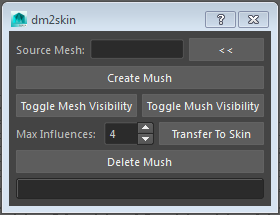

# dm2skin
 A Python script for Maya that allows you to convert the results of a delta mush deformer to standard skin weights.

#How To Use

1. Skin your mesh to its skeleton using skinning options similar to the ones below. It's important that initially you use only one influence per vertex.

	

2. Paint your skin weights so that each part of your mesh is deformed reasonably (despite only having one weight per vert). Obviously it'll look pretty terrible, but if you make it as tidy as you can the delta mushed version will look better later.
3. Open the dm2skin UI using the following code.

	~~~
	import dm2skin
	dm2skin.dm2skin()
	~~~
A GUI should appear that looks like this.

	

4. Select your newly skinned mesh and hit the **<<** button. Your mesh will be added to the field to the left.

5. Hit **Create Mush**. A new version of your mesh should be created called **\<YourMesh\>\_Mush**.

6. Keyframe a set of extreme poses making sure to leave the first frame on your timeline as the **bind pose**. I have found 4 / 5 poses works well. Theses poses should move and rotate the characters bones in to all the kinds of poses that your character will need to achieve. The conversion process is purely mathematical and if you don't provide enough information to it you won't get very good results.  
7. Select this mesh and tweak the **deltaMush** deformer to give the results you are after. You can use the **Toggle Mesh Visibility** and **Toggle Mush Visibility** buttons in the GUI to easily hide and show the two meshes. 

8. When you're happy set the **Max Influences** value which corresponds to the maximum number of influences that will be used for your skin cluster once the conversion has completed. In my experiments I've found 4 to be about the lowest you'll want to go to give decent results.

9. Hit **Transfer To Skin**.

10. Wait while the tool does its work. The conversion process will take longer the more verts that are present in the mesh. Increasing the **Max Influences** value will also increase the time the process takes. A 10k vert mesh using 5 influences takes around 2 minutes on my work PC.

11. Once the process finishes you can have a look at the result. If you're not happy just hit undo and the weights will go back to your previous rigid weights.

12. If you are happy hit **Delete Mush** and do any tweaks to the weights that you think are necessary.
